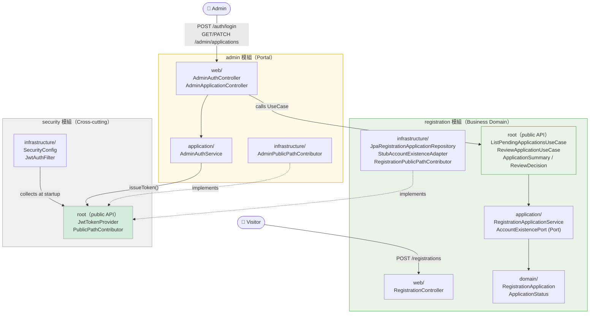

# MODULE-TYPES.md — 模組類型建置規範與相依規則

<!--
狀態：最後與 codebase 對齊 — SLICE-003（2026-05-11）
相關決策：DEC-014（admin 單向依賴 security）、DEC-015（PUBLIC 路徑：各模組聲明，security 收集）、DEC-019（admin = 薄 Portal）、DEC-020（root = 公開 API）
變更原則：新建任何模組前必須讀此文件並回答「模組角色（Business Domain / Cross-cutting / Portal）」與「此模組不負責什麼」。新增模組角色類型時，須補對應 DEC 條目。
-->

本文件說明本專案中不同類型模組的建置規範、相依宣告規則、以及三種特殊模組角色（Business Domain、Cross-cutting、Portal）的思考框架。

開發者在新建或擴充模組前，應先對照本文件確認模組定位。

---

## 一、三種模組角色

### 1. Business Domain 模組（業務域）

**特徵**：擁有真實的業務語意。Aggregate Root、狀態機、業務不變式（INV）都在這裡。

**現有範例**：`registration`

**建置規範**：
- Root package 放跨模組公開 API（UseCase interfaces、共享 DTO、enum）
- Sub-packages：`domain/`（Entity、VO、狀態機）、`application/`（Service、Command、Port interface）、`infrastructure/`（JPA 實作、Adapter）、`web/`（Controller）
- `package-info.java` 的 `displayName` 應反映業務語意（如 `"Registration"`），不用技術術語
- `allowedDependencies` 預設不宣告（只依賴 `security` 等基礎設施時才加）

**INV 責任**：業務不變式由 Domain Entity 的方法直接執行，Application Service 協調並調用。UseCase interface 的 Javadoc 標注對應的 INV-###。

**跨模組暴露原則**：
- 需要讓其他模組觸發業務行為 → 暴露 UseCase interface（root package）
- 需要讓其他模組讀取結果 → 暴露 DTO/record（root package）
- **不暴露** Entity、Repository、內部 Command

---

### 2. Cross-cutting 模組（橫切關注點）

**特徵**：提供技術基礎設施，被所有或多數業務模組使用，但自身不擁有業務語意。

**現有範例**：`security`

**建置規範**：
- Root package 放被消費的公開 API（目前：`JwtTokenProvider`、`PublicPathContributor`）
- 不宣告 `allowedDependencies`（不需要主動依賴業務模組）
- 使用**反向依賴**設計：業務模組實作此模組定義的 interface，此模組在執行期收集所有實作——不是此模組依賴業務模組，是業務模組依賴此模組

**安全盲點（已知風險）**：Cross-cutting 模組的 root package 類型（如 `JwtTokenProvider`）對任何宣告 `allowedDependencies` 包含 `security` 的模組都可見。Modulith verifier 不會限制「只能呼叫哪些方法」。目前靠 ARCH-RULE-006 防止 `org.springframework.security.web.*` 的濫用，但應用層面的呼叫濫用需要 Code Review 守門。

> 如未來 Cross-cutting 模組的 public API 增多，應評估引入 `@NamedInterface` 分層，將不同用途的 API 分區管理。

**ARCH-RULE 守護**：`ARCH-RULE-006` — 只有 `security` 模組可以依賴 `org.springframework.security.web.*`。

---

### 3. Portal 模組（薄入口層）

**特徵**：聚合多個業務模組的操作入口，自身不擁有業務語意，只做 HTTP adapter + 身份認證。

**現有範例**：`admin`

**建置規範**：
- `allowedDependencies` 隨每個新業務功能增長，**每次新增都是有意識的宣告**，不是壞味道
- Controller 只做：解析 HTTP request → 萃取 JWT principal → 呼叫 domain UseCase → 回傳 HTTP response
- 業務規則不在 Portal 模組的 Service 裡，Portal 的 Service 只做 Controller 的輕量協調（若有）
- URL 前綴（如 `/admin/`）是路由慣例，不代表此 URL 下的業務語意屬於 Portal 模組

**判斷：某功能應該在 Portal 還是在 Domain？**

問：「如果拿掉 admin 入口，這個業務規則還應該存在嗎？」  
→ 是 → 規則屬於 domain 模組，Portal 只觸發  
→ 否 → 可能屬於 Portal（但這種情況非常少）

**模組建立時的強制宣告**：
> Portal 模組在第一個迭代建立時，`package-info.java` 的 `displayName` 必須包含 "Portal" 字樣，`@ApplicationModule` 的 Javadoc 必須明確說明「什麼不屬於此模組」。遲到宣告的代價是後續迭代的架構歧義。

---

## 二、SLICE 類別與模組建置對應

### Business SLICE
觸及：Business Domain 模組的新功能或狀態擴充。

模組建置重點：
- 新 Entity 方法 + 對應 INV → `domain/`
- 新 UseCase interface → 模組 root
- 新 Application Service 方法 → `application/`
- 新 JPA query → `infrastructure/`
- 新 Controller endpoint → `web/`
- Portal 模組有新 Controller 觸發此 UseCase → 更新 `allowedDependencies`

INV 必要性：視業務規則密度。有狀態轉換必須有 INV。  
AC 必要性：**必須**（Given/When/Then 格式，actor 是 Visitor 或具名角色）。

### Infrastructure SLICE
觸及：Cross-cutting 模組建立，或技術基礎設施橫向鋪設。

模組建置重點：
- Cross-cutting 模組 root 放公開 interface（讓業務模組實作）
- 反向依賴設計：此模組定義 interface，業務模組的 `infrastructure/` 放 Adapter 實作
- 新增 ARCH-RULE 守護橫切關注點邊界

INV 必要性：通常無。  
AC 必要性：**必須**（格式：「機制 X 在情境 Y 下正確運作」，actor 可以是 Admin 或 System）。

### Integration SLICE
觸及：兩個既有模組之間建立新的協作（Portal 呼叫 Domain UseCase 屬於此類）。

模組建置重點：
- Domain 模組新增 UseCase interface 到 root package（如 `ReviewApplicationUseCase`）
- Portal 模組更新 `allowedDependencies`
- Portal Controller 萃取 principal 後呼叫 UseCase，不重複業務邏輯
- 確認 Modulith verifier 通過（`ModulithVerifierTest`）

INV 必要性：跨模組契約 INV（Domain 模組在 UseCase 實作中執行不變式，Portal 不加額外 INV）。  
AC 必要性：**必須**（整合後端到端業務劇本，Given 包含跨模組的前置狀態）。

---

## 三、`package-info.java` 填寫規範

每個模組的 root `package-info.java` 必須包含：

```java
/**
 * {模組名稱} 模組 — {一句話職責描述}
 *
 * Public API（root package）:
 *   - {公開的 UseCase interface 或類型列表}
 *
 * Internal（sub-packages）:
 *   - domain/: {說明}
 *   - application/: {說明}
 *   - infrastructure/: {說明}
 *   - web/: {說明}
 *
 * 此模組不負責：{明確列出邊界外的事項}（防 God Module）
 *
 * Cross-module dependencies:
 *   - {依賴的模組}: {依賴原因}
 */
@org.springframework.modulith.ApplicationModule(
        displayName = "{模組 displayName}",
        allowedDependencies = {"{依賴模組列表，若無則省略此屬性}"}
)
package com.example.backend.{module};
```

「此模組不負責」欄位是強制的。若填不出來，代表模組定位還沒想清楚，不應開始實作。

---

### 實際範本

**範本 A：Business Domain 模組（registration）**

```java
/**
 * Registration 模組 — 管理訪客提出帳號申請的完整生命週期。
 *
 * Public API（root package）:
 *   - ListPendingApplicationsUseCase: 查詢 PENDING 申請清單
 *   - ReviewApplicationUseCase:       對申請執行 approve / reject
 *   - ApplicationSummary:             跨模組傳遞的申請摘要 DTO
 *   - ReviewDecision:                 審核決策 enum（APPROVE / REJECT）
 *
 * Internal（sub-packages）:
 *   - domain/:          RegistrationApplication（Aggregate Root）、ApplicationStatus
 *   - application/:     RegistrationApplicationService、Port interfaces（AccountExistencePort、Repository）
 *   - infrastructure/:  JPA 實作、StubAccountExistenceAdapter、RegistrationPublicPathContributor
 *   - web/:             RegistrationController（POST /registrations，PUBLIC）
 *
 * 此模組不負責：帳號建立（Account 模組職責）、Admin 身份驗證（security / admin 模組職責）
 *
 * Cross-module dependencies:
 *   - security: PublicPathContributor（宣告 /registrations 為 PUBLIC 路徑）
 */
@org.springframework.modulith.ApplicationModule(displayName = "Registration")
package com.example.backend.registration;
```

---

**範本 B：Cross-cutting 模組（security）**

```java
/**
 * Security 模組 — JWT 身份驗證的橫切基礎設施。
 *
 * Public API（root package）:
 *   - JwtTokenProvider:       JWT 簽發與驗證（供 admin 模組呼叫）
 *   - PublicPathContributor:  各業務模組實作此 interface 宣告 PUBLIC 路徑
 *
 * Internal（sub-packages）:
 *   - infrastructure/: SecurityConfig（收集所有 PublicPathContributor，建立 filter chain）
 *                      JwtAuthFilter（攔截請求，驗證 Bearer token）
 *
 * 此模組不負責：Admin 帳號管理（admin 模組）、角色授權（未來 SLICE）、Token refresh（未來 SLICE）
 *
 * Cross-module dependencies: 無
 *   （設計原則：業務模組依賴 security，security 不依賴任何業務模組）
 */
@org.springframework.modulith.ApplicationModule(displayName = "Security")
package com.example.backend.security;
```

---

**範本 C：Portal 模組（admin）**

```java
/**
 * Admin Portal 模組 — 管理者操作的 HTTP 入口層。
 *
 * Public API（root package）: 無（不暴露任何跨模組 API，只消費其他模組的 UseCase）
 *
 * Internal（sub-packages）:
 *   - domain/:          AdminCredential（admin 帳號 entity，只有此模組使用）
 *   - application/:     AdminAuthService（帳密驗證、JWT 簽發）、AdminCredentialRepository（Port）
 *   - infrastructure/:  JpaAdminCredentialRepository、AdminPublicPathContributor
 *   - web/:             AdminAuthController（POST /auth/login）
 *                       AdminApplicationController（GET、PATCH /admin/applications/**）
 *
 * 此模組不負責：申請審核的業務規則（registration 模組職責）、帳號建立（Account 模組職責）
 *   controller 只做：解析 HTTP → 萃取 JWT principal → 呼叫 domain UseCase → 回傳 HTTP response
 *
 * Cross-module dependencies:
 *   - security:      JwtTokenProvider（簽發與驗證 JWT）、PublicPathContributor（宣告 /auth/login）
 *   - registration:  ListPendingApplicationsUseCase、ReviewApplicationUseCase（觸發業務行為）
 */
@org.springframework.modulith.ApplicationModule(
        displayName = "Admin Portal",
        allowedDependencies = {"security", "registration"}
)
package com.example.backend.admin;
```

---

### 模組相依關係圖



